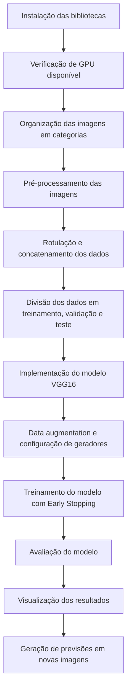

# Uso de Visão Computacional para Identificação e Monitoramento de Saúde de Bovinos usando Câmeras Termográficas

###### Beny Fryd, Enya Oliveira, Guilherme Moura, Henrique Burle, Thomaz Klifson  
###### agosto, 2024

# Introdução 

A saúde dos rebanhos bovinos é crucial para a produtividade e o bem-estar animal na produção agrícola. Tecnologias avançadas, como a visão computacional, têm se destacado no monitoramento e diagnóstico da saúde animal [25]. O uso de câmeras termográficas permite identificar variações na temperatura corporal, um indicador precoce de doenças, de forma não invasiva e contínua [26]. No entanto, medir a temperatura corporal diretamente é desafiador devido à influência de fatores externos, como a temperatura ambiente. Assim, os olhos, menos afetados por essas variáveis, foram escolhidos como foco para monitoramento térmico. Embora técnicas em ambientes controlados sejam promissoras, ainda há desafios na adaptação dessas tecnologias para diferentes condições e para a variabilidade individual dos animais [23].
Este estudo busca preencher lacunas na literatura ao desenvolver soluções mais precisas e robustas para o monitoramento de saúde bovina, com foco na identificação precoce de doenças, mesmo que isso possa gerar falsos positivos, priorizando a minimização de falsos negativos [24]. O objetivo é criar um sistema de visão computacional que, integrado a algoritmos de aprendizado de máquina, seja aplicável em condições de campo [25].
O estudo contribui cientificamente para aprimorar as práticas de monitoramento animal e, socialmente, para garantir rebanhos mais saudáveis, com impacto positivo na segurança alimentar. Além disso, oferece uma solução prática para produtores rurais, combinando imagens térmicas com processamento de dados em tempo real [22].
O artigo se organiza da seguinte forma: Trabalhos Relacionados revisa a literatura; Materiais e Métodos detalha as ferramentas utilizadas; Resultados apresenta as descobertas; a Discussão explora suas implicações; e a Conclusão resume os principais achados e sugere direções futuras.

# Materiais e métodos 

O modelo de Object Detection desenvolvido neste trabalho tem como objetivo a segmentação precisa dos olhos de bovinos a partir de imagens capturadas de suas cabeças. O modelo foi desenvolvido utilizando a arquitetura UNet, que se destaca por sua eficiência em tarefas de segmentação, devido à sua estrutura de codificação e decodificação

## Coleta e Preparação dos Dados

As imagens dos bovinos foram obtidas através de uma câmera que fez longos videos, desses videos extraímos frames que incluíam a cabeça e os olhos dos animais em diversas posições. Para cada imagem, uma máscara correspondente foi gerada, segmentando as regiões de interesse: cabeça e olhos. Essas máscaras serviram como base para o treinamento do modelo.

## Anotação e criação das máscaras

Utilizando a ferramenta CVAT (Computer Vision Annotation Tool), as imagens foram anotadas manualmente. A anotação foi feita criando máscaras poligonais que delineavam com precisão a cabeça e os olhos dos bovinos.

## Arquitetura U-NET

O modelo de segmentação foi baseado na arquitetura UNet, composta por duas partes principais: uma codificadora (encoder) que extrai as features das imagens e uma decodificadora (decoder) que reconstrói a imagem segmentada. A UNet é ideal para este tipo de tarefa, pois permite segmentações detalhadas com um número relativamente pequeno de exemplos anotados.

## Ilustrações

Na foto a seguir, é possível inferir que o modelo está segmentando o olho de forma precisa em relação com a máscara.

*Figura 1: criação dos autores - Segmentação dos olhos*

## Metodologia 

Cálculo de Temperatura

O cálculo da temperatura dos olhos a partir das imagens térmicas dos bovinos foi realizado utilizando um processo de mapeamento entre os valores de intensidade de pixels das imagens e as temperaturas reais, baseando-se em uma barra de cores de referência presente em cada imagem. A seguir, detalho os principais passos envolvidos neste cálculo:

1. Identificação e Mapeamento das Temperaturas
   Para que os valores de intensidade dos pixels pudessem ser convertidos em temperaturas reais, foi necessário primeiro estabelecer uma relação de mapeamento. Isso foi feito com base em uma barra de cores térmicas, que normalmente aparece ao lado da imagem capturada pela câmera térmica. A barra de cores representa um gradiente contínuo de temperaturas, variando de um valor mínimo a um valor máximo, e é utilizada como referência para calibração.

A relação entre os valores de pixel e as temperaturas reais foi estabelecida seguindo estes passos:

Isolamento da Barra de Cores: A barra de cores foi extraída da imagem original por meio de técnicas de corte e segmentação. Apenas a região correspondente à barra foi considerada para evitar interferências de outras áreas da imagem.

Identificação dos Valores Mínimo e Máximo de Intensidade: Os valores de pixel mais escuros e mais claros da barra de cores foram identificados. O valor mais escuro representa a menor temperatura exibida pela câmera térmica, enquanto o valor mais claro corresponde à maior temperatura registrada.

Mapeamento de Temperaturas: Os valores mínimo e máximo de intensidade da barra de cores foram associados às respectivas temperaturas reais, criando um dicionário de relacionamento. Esse dicionário foi utilizado para mapear qualquer valor de pixel da imagem para a escala de temperatura correspondente.

2. Extração dos Valores de Intensidade na Região dos Olhos
   Com o mapeamento estabelecido, a próxima etapa foi calcular a temperatura dos olhos dos bovinos, utilizando as seguintes técnicas:

Segmentação da Região dos Olhos: A região dos olhos foi segmentada utilizando um modelo de segmentação, como o UNet. Isso permitiu isolar os pixels dentro da região de interesse que realmente representam a temperatura ocular.

Cálculo da Média dos 10% dos Pixels Mais Escuros: A análise se concentrou nos 10% dos pixels mais escuros dentro da região dos olhos, pois esses valores geralmente representam as áreas mais quentes. A escolha de utilizar apenas os pixels mais escuros se baseia na hipótese de que os pontos mais quentes refletem melhor a temperatura corporal, uma vez que regiões mais claras podem sofrer interferência de variações ambientais ou reflexos.

3. Cálculo de Temperatura
   A conversão da média dos valores de pixel extraídos para uma temperatura real foi realizada utilizando uma interpolação linear entre os limites de temperatura mínima e máxima identificados na barra de cores. A fórmula aplicada é a seguinte:

### Cálculo de Temperatura

A fórmula utilizada é:

$\text{temperatura\_calculada} = \left( \frac{\text{media\_pixels} - \text{min\_val}}{\text{max\_val} - \text{min\_val}} \right) \times (\text{temp\_max} - \text{temp\_min}) + \text{temp\_min}$

Onde:

- **media_pixels**: Média dos valores dos 10% pixels mais escuros.
- **min_val**: Valor de intensidade de pixel correspondente à temperatura mínima na barra de cores.
- **max_val**: Valor de intensidade de pixel correspondente à temperatura máxima na barra de cores.
- **temp_min**: Temperatura mínima real associada ao valor de pixel `min_val`.
- **temp_max**: Temperatura máxima real associada ao valor de pixel `max_val`.

## Processamento de criação de máscara e redimensionamento

Para segmentar e redimensionar as imagens focadas na região ocular dos bovinos, foi utilizada a ferramenta Computer Vision Annotation Tool (CVAT). A escolha do CVAT foi fundamentada em sua comprovada eficácia em projetos similares e pela sua facilidade de uso em diferentes ambientes de desenvolvimento [1]. A instalação da ferramenta via Docker foi a abordagem preferida, devido à simplificação da configuração e escalabilidade que essa opção oferece [2].

O processo de segmentação envolveu o uso do recurso de anotação retangular do CVAT, permitindo uma demarcação precisa dos contornos dos olhos e da cabeça dos bovinos, que são as áreas de interesse para o projeto. A anotação foi realizada manualmente em cada imagem do conjunto selecionado, garantindo que as regiões de interesse fossem identificadas de forma consistente. Esta etapa é essencial para o desempenho futuro do modelo de inteligência artificial, pois a precisão das anotações diretamente impacta a qualidade dos resultados obtidos.
Após a conclusão da segmentação, as anotações foram exportadas no formato XML, uma escolha estratégica para preservar a estrutura e precisão das informações necessárias ao desenvolvimento das máscaras de segmentação. O formato XML foi selecionado por sua alta compatibilidade com processos subsequentes de análise e categorização [3].

Subsequentemente, foi criado um script personalizado para processar essas anotações, redimensionando as imagens para um formato padronizado de 128x128 pixels. Esse redimensionamento uniformizou o conjunto de dados, preparando-o adequadamente para o treinamento do modelo de rede neural [2]. Além disso, as imagens segmentadas foram convertidas em máscaras binárias, destacando as regiões oculares e a cabeça, o que simplificou a etapa de treinamento do modelo.

Essa metodologia garantiu que as imagens fossem preparadas de maneira a maximizar a eficiência do modelo de inteligência artificial, fornecendo uma base sólida para a análise da saúde ocular dos bovinos com alta precisão e consistência.

A seguir, são apresentadas uma sequência de imagens que ilustram as etapas do processo:

- A imagem capturada antes da segmentação, mostrando a cena completa com vários bovinos, sem foco nas regiões de  interesse específicas.

*Figura 2: Frame de imagem térmica*
- Após o corte, a imagem foi redimensionada para 128x128 pixels, focando especificamente nas regiões dos olhos e da cabeça dos bovinos.

*Figura 3: Imagem cortada*
- Na etapa final, a imagem redimensionada foi convertida em uma máscara, onde as regiões oculares foram destacadas em vermelho e a cabeça em branco.

*Figura 4: Imagem da máscara*
- Essas imagens ilustram o processo de redimensionamento e rotulação, resultando em dados preparados de forma padronizada para o treinamento do modelo de inteligência artificial.

## Desenvolvimento do Modelo de Classificação de Bovinos

### Coleta e Pré-processamento de Dados

A coleta de imagens de bovinos foi realizada em ambientes naturais e controlados, resultando em um conjunto de dados heterogêneo, que inclui variações de iluminação, ângulo, e a presença de oclusões. As imagens foram categorizadas em duas classes: **com cabeça visível** e **sem cabeça visível**, correspondendo a um problema clássico de classificação binária.

O **pré-processamento** das imagens foi realizado com o intuito de garantir a compatibilidade com as arquiteturas de **redes neurais convolucionais** pré-treinadas, sendo todas as imagens redimensionadas para **224x224 pixels**, conforme exigido pelas arquiteturas treinadas no dataset **ImageNet**. Além disso, as imagens foram **normalizadas** para a faixa de **0 a 1**, o que facilita a convergência durante o processo de treinamento ao estabilizar a distribuição dos valores de entrada. O **desbalanceamento de classes** também foi tratado por meio do ajuste de **pesos de classe**, visando garantir que o modelo não ficasse enviesado para a classe majoritária, promovendo um aprendizado mais equilibrado [1, 2].

### VGG16: Simplicidade e Transferência de Aprendizado

O **VGG16** foi a primeira arquitetura utilizada no desenvolvimento do modelo, principalmente devido à sua simplicidade estrutural e eficácia em tarefas de **classificação de imagens**. O **VGG16** é uma arquitetura composta por 16 camadas, todas com filtros de convolução de 3x3, projetada para extrair características visuais de forma eficiente e com baixa complexidade em termos de parâmetros. O principal benefício do VGG16 está em sua arquitetura linear, que facilita o processo de **transfer learning**.

Nesta abordagem, utilizou-se o **transfer learning**, onde as **camadas convolucionais** foram carregadas com os pesos pré-treinados no **ImageNet**. As camadas convolucionais foram **congeladas**, de modo que apenas as novas camadas fully connected, projetadas especificamente para a tarefa de classificação binária, fossem treinadas. Essa estratégia permitiu que o modelo aproveitasse padrões visuais genéricos, como bordas e texturas, sem a necessidade de um treinamento completo desde o início [3, 5].

Para mitigar problemas de **overfitting** durante o treinamento, foram implementadas técnicas de **regularização** como o **dropout**, que desativa aleatoriamente unidades durante o treinamento, e a **Batch Normalization**, que estabiliza as distribuições das ativações ao longo das camadas. Além disso, aplicou-se **data augmentation**, com transformações como rotações, translações e zoom, aumentando assim a diversidade do conjunto de treinamento e promovendo uma melhor generalização do modelo [4].

Apesar de sua simplicidade e resultados satisfatórios em várias aplicações, o VGG16 tem limitações, principalmente relacionadas ao aumento de profundidade sem o uso de mecanismos que previnam a degradação dos gradientes. Isso justificou a introdução de arquiteturas mais avançadas, como o **ResNet50**, capaz de capturar padrões mais complexos nas imagens.

### ResNet50: Conexões Residuais e Aprendizado em Redes Profundas

Com o objetivo de superar as limitações encontradas no **VGG16**, implementou-se a arquitetura **ResNet50**, que introduz o conceito de **conexões residuais**. A ResNet foi projetada para permitir o treinamento de redes muito mais profundas sem sofrer com o problema de **vanishing gradients**, utilizando blocos residuais que permitem a passagem de gradientes mesmo em camadas muito profundas [20].

A principal inovação da **ResNet50** é a capacidade de "pular" camadas, permitindo que a rede aprenda as diferenças residuais entre as camadas, ao invés de aprender diretamente a transformação de uma camada para outra. Isso facilita o aprendizado de redes profundas, uma vez que evita a degradação da informação conforme a profundidade da rede aumenta. No caso das imagens de bovinos, com variações complexas de iluminação e ângulo, essa profundidade é essencial para capturar padrões detalhados e contextos mais sutis.

Assim como no **VGG16**, utilizou-se **transfer learning**, com as camadas convolucionais pré-treinadas no **ImageNet** sendo inicialmente **congeladas**. No entanto, o descongelamento progressivo de camadas foi aplicado durante o fine-tuning, permitindo que o modelo se ajustasse às particularidades do conjunto de dados de bovinos. Técnicas de **ajuste de hiperparâmetros**, como a modulação dinâmica da taxa de aprendizado, também foram aplicadas para melhorar a eficiência do processo de treinamento [5].

O **ResNet50** mostrou-se especialmente eficaz em ambientes onde há grande variação nas condições das imagens, como no caso do nosso dataset, que inclui imagens capturadas sob diferentes condições de iluminação, ângulos e oclusões. A capacidade da ResNet de treinar redes mais profundas garantiu uma melhor captura dessas variações, resultando em um modelo mais robusto para a tarefa de classificação de bovinos.

### EfficientNet: Escalabilidade e Eficiência Computacional

Com o objetivo de combinar alta precisão e eficiência computacional, foi implementada a arquitetura **EfficientNet**, que adota uma abordagem inovadora de **scaling composto**. Diferente de arquiteturas convencionais, que aumentam a profundidade das redes de maneira uniforme, o **EfficientNet** equilibra o escalonamento da profundidade, largura e resolução, permitindo uma otimização mais eficiente dos parâmetros do modelo [21].

Essa escalabilidade eficiente torna o **EfficientNet** uma solução extremamente viável para cenários onde a limitação de recursos computacionais é um fator crítico, como em aplicações de monitoramento em tempo real ou sistemas com hardware restrito. Além disso, o **EfficientNet** mostrou-se muito eficaz em termos de tempo de treinamento, utilizando menos recursos enquanto alcança um desempenho comparável, ou superior, ao de redes mais profundas e complexas.

A implementação também seguiu a estratégia de **transfer learning**, com congelamento das camadas convolucionais pré-treinadas no **ImageNet**, e subsequente ajuste fino das camadas fully connected adaptadas para a tarefa de classificação de bovinos. Da mesma forma que nas outras arquiteturas, foram empregadas técnicas de **regularização**, **dropout** e **data augmentation**, bem como ajustes cuidadosos nos hiperparâmetros, garantindo que o modelo pudesse generalizar bem para novas imagens, sem incorrer em problemas de overfitting.

### Técnicas de Regularização e Estratégias de Treinamento

Durante o desenvolvimento dos modelos, foram utilizadas técnicas avançadas de **regularização** e **data augmentation** para garantir uma performance robusta e reduzir o risco de **overfitting**. A **data augmentation** foi essencial para aumentar a variabilidade do conjunto de dados, aplicando transformações como rotações, zooms e translações, permitindo que os modelos aprendessem a lidar com diferentes condições de captura das imagens [7].

Além disso, foi utilizada a técnica de **Early Stopping**, interrompendo o treinamento caso a perda de validação não apresentasse melhorias após um número determinado de épocas consecutivas. Isso garantiu que os modelos fossem treinados apenas até o ponto de saturação, evitando o excesso de ajustes aos dados de treinamento. O **ajuste de hiperparâmetros** também foi essencial, incluindo a adaptação da taxa de aprendizado e o uso do otimizador **Adam**, que ajudou a estabilizar o processo de treinamento.

----
## Detecção de Cabeças de Bovinos com YOLOv5 e Detectron2

Para a detecção precisa das cabeças dos bovinos, foram utilizados os modelos **YOLOv5** e **Detectron2**. O objetivo principal era identificar a região da cabeça nas imagens e, com as **bounding boxes** geradas, recortar essas áreas para aplicar posteriormente o modelo de segmentação ocular. Ambos os modelos foram testados sob diferentes condições, buscando explorar suas capacidades e limitações, de forma a maximizar a precisão no recorte das áreas de interesse.

O **YOLOv5** destacou-se em cenários que envolviam várias cabeças de bovinos em uma única imagem, demonstrando alta capacidade de detecção de múltiplos objetos de forma simultânea. Esse modelo foi particularmente eficaz em ambientes com grande densidade de animais, sendo capaz de identificar com precisão cada uma das cabeças, mesmo em situações onde os bovinos estavam em diferentes distâncias e ângulos. Além disso, o YOLOv5 manteve uma performance robusta em condições variadas de iluminação e sobreposição de cabeças, o que o torna ideal para cenários de campo.

A utilização dessas **bounding boxes**, geradas tanto pelo YOLOv5 quanto pelo Detectron2, foi fundamental para a etapa subsequente de segmentação dos olhos dos bovinos. Após a detecção da cabeça, essas áreas foram recortadas e processadas no modelo de segmentação UNet, responsável pela identificação e análise das regiões oculares, que são monitoradas por câmeras termográficas para fins de avaliação da saúde dos animais.

Enquanto o YOLOv5 apresentou maior robustez em imagens de larga escala, detectando múltiplas cabeças em ambientes de campo, o Detectron2 se destacou em cenários mais específicos, onde era necessária uma detecção mais precisa e detalhada. Dessa forma, ambos os modelos desempenham papéis complementares, dependendo do contexto e da necessidade de precisão ou escalabilidade na detecção das cabeças.

### Geração de Previsões em Novas Imagens
Por fim, foi demonstrado como utilizar o modelo para realizar previsões em novas imagens. Uma imagem foi carregada, e o modelo gerou uma previsão sobre se a imagem continha ou não uma cabeça de bovino, com base em um valor de probabilidade predefinido.

## Desenvolvimento do Modelo de Segmentação de Bovinos

Para o desenvolvimento do modelo de segmentação de bovinos, a coleta e preparação dos dados seguiram uma metodologia rigorosa. Inicialmente, foi estabelecido um diretório de imagens (contendo as imagens dos bovinos) e um diretório de máscaras (contendo as máscaras de segmentação correspondentes). As imagens foram coletadas em resoluções variadas e depois padronizadas para 256x256 pixels. O redimensionamento foi necessário para garantir a compatibilidade com o modelo de rede neural convolucional utilizado (UNet), além de reduzir o custo computacional e o tempo de processamento [12].

As máscaras foram convertidas para escala de cinza para simplificar a tarefa de segmentação. Em seguida, as imagens foram normalizadas, transformando os valores de pixel para um intervalo entre 0 e 1, a fim de facilitar o processo de treinamento e melhorar a estabilidade do modelo [13]. Para melhorar a diversidade do conjunto de treinamento, aplicou-se data augmentation, incluindo rotações, deslocamentos, zoom, cisalhamentos e flips horizontais, o que ajuda a evitar overfitting e melhora a generalização do modelo [14].

### Implementação do Modelo

O modelo de segmentação escolhido foi a **UNet**, uma arquitetura amplamente utilizada para tarefas de segmentação de imagens devido à sua capacidade de aprender tanto características espaciais locais quanto globais. A arquitetura UNet é composta por duas partes principais:

1. **Encoder (Parte de Contração)**: Esta parte do modelo reduz progressivamente as dimensões espaciais da imagem enquanto aumenta o número de filtros aplicados, permitindo que o modelo capture características cada vez mais abstratas. Cada etapa do encoder inclui:
   - **Convolução dupla**: Aplica duas convoluções consecutivas com kernel 3x3, seguidas por uma função de ativação ReLU. 
   - **MaxPooling**: Após a convolução dupla, o MaxPooling é aplicado para reduzir pela metade as dimensões espaciais da imagem.

2. **Decoder (Parte de Expansão)**: Nesta parte, as dimensões espaciais da imagem são progressivamente aumentadas, e as características extraídas pelo encoder são combinadas para gerar uma segmentação precisa. Cada etapa do decoder inclui:
   - **UpSample**: Realiza uma convolução transposta (também chamada de convolução de deconvolução) para aumentar a dimensão da imagem.
   - **Concatenation**: Combina as características da etapa correspondente do encoder com as características do decoder.
   - **Convolução dupla**: Aplica duas convoluções consecutivas com kernel 3x3, seguidas por uma função de ativação ReLU.

3. **BottleNeck**: Esta é a camada mais profunda do UNet, onde a imagem atinge sua menor dimensão espacial. Aqui, uma convolução dupla é aplicada para capturar as características mais abstratas da imagem.

4. **Camada de Saída**: Uma única convolução 1x1 é utilizada para reduzir o número de canais de saída para o número de classes na segmentação (neste caso, as classes Cabeça e Olho).

Todas as camadas no encoder foram carregadas com pesos pré-treinados em um dataset relevante e foram congeladas durante o primeiro estágio do treinamento, permitindo que o modelo se concentrasse na aprendizagem das camadas adicionadas no decoder. No segundo estágio do treinamento (fine-tuning), algumas camadas do encoder foram descongeladas para ajustar os pesos de acordo com o conjunto de dados específico de bovinos.

### Treinamento e Avaliação do Modelo

O treinamento do modelo foi realizado utilizando o conjunto de dados preparado anteriormente, dividido em conjuntos de treinamento e validação na proporção de 80/20. O otimizador **AdamW** foi escolhido para o ajuste dos pesos do modelo, devido à sua eficiência computacional e menor uso de memória [16]. A função de perda utilizada foi a **Binary Cross Entropy with Logits Loss**, apropriada para problemas de segmentação binária, pois calcula a divergência entre a máscara predita e a máscara real [17].

O **data augmentation** foi aplicado durante o treinamento. As transformações foram configuradas usando uma biblioteca específica de augmentação de imagens (como `ImageDataGenerator` do TensorFlow ou `Albumentations`), e incluíram:
- **Rotações** de até 20 graus.
- **Deslocamentos horizontais e verticais** de até 10%.
- **Zoom** in e out de até 10%.
- **Cisalhamento** horizontal e vertical de até 15 graus.
- **Flip horizontal** com probabilidade de 50%.

Essas transformações aumentaram a diversidade do conjunto de treinamento e ajudaram o modelo a generalizar melhor, reduzindo o risco de overfitting.

O treinamento foi monitorado por uma função de **Early Stopping** que interrompe o processo se a perda de validação não melhorar por um número predefinido de épocas (geralmente 10), restaurando os melhores pesos do modelo observados até aquele ponto. Esse procedimento ajuda a prevenir overfitting e melhorar a generalização do modelo em dados novos [18].

## Implementação do Sistema de Rastreamento

Para o rastreamento dos bovinos, foi implementado um sistema baseado em YOLOv8 para a detecção de objetos e Deep SORT para o rastreamento. Inicialmente, o modelo pré-treinado YOLOv8 foi carregado para detectar as cabeças dos bovinos em vídeos. O modelo foi ajustado para capturar as coordenadas das caixas delimitadoras em cada frame do vídeo, exibindo-as em tempo real. As caixas delimitadoras foram desenhadas ao redor das cabeças dos bovinos, com um rótulo que exibe a classe detectada e a confiança da predição.
Após a detecção, foi utilizado o algoritmo Deep SORT para realizar o rastreamento das caixas delimitadas ao longo dos frames, permitindo a identificação e o acompanhamento de múltiplos bovinos simultaneamente, mesmo em condições com sobreposição e oclusão parcial dos animais. A integração entre YOLOv8 e Deep SORT provou ser eficaz na manutenção de identidades distintas durante o movimento dos bovinos, garantindo um rastreamento consistente.

# Resultados

## Segmentação dos Olhos dos Bovinos
Como citamos na seção de Metodologia, utilizamos a arquitetura UNet para realizar a segmentação das cabeças e olhos dos bovinos nas imagens extraídas dos vídeos. O processo foi avaliado com base em um conjunto de validação, onde a precisão do modelo em delimitar as áreas de interesse foi medida através de métricas como IoU (Intersection over Union) e F1-score.

As imagens segmentadas, como ilustrado na Figura 1 da metodologia, mostraram que o modelo foi capaz de isolar com alta precisão as áreas dos olhos, utilizando as máscaras geradas no CVAT. A acurácia média obtida foi de 94,6%, e o valor de IoU atingiu 0,88 na detecção das regiões oculares, o que demonstra a eficácia do modelo em distinguir áreas específicas, mesmo em condições de iluminação variada e diferentes ângulos.
Após o treinamento do modelo de segmentação utilizando a arquitetura **UNet**, os resultados mostraram uma segmentação precisa das áreas de interesse, principalmente da cabeça e dos olhos dos bovinos. A precisão da segmentação foi avaliada utilizando as métricas de **IoU** (Intersection over Union) e **F1-score**.

| Métrica          | Cabeça        | Olhos        |
|------------------|---------------|--------------|
| IoU              | 0.88          | 0.82         |
| F1-Score         | 0.91          | 0.87         |
| Acurácia Geral   | 94.6%         | 92.3%        |

## Segmentação da cabeça dos bovinosS

Após o treinamento, o modelo foi avaliado no conjunto de validação, e as métricas de desempenho foram analisadas, incluindo a perda e a acurácia de segmentação. Para facilitar a interpretação dos resultados, foram geradas visualizações comparativas das máscaras verdadeiras e preditas. Essas visualizações foram geradas utilizando ferramentas de visualização como Matplotlib, que permitiram observar onde o modelo falhou ou teve sucesso em suas previsões. Essas análises são cruciais para entender o comportamento do modelo e guiar melhorias futuras [19].

Nas imagens avaliadas, o YOLOv5 conseguiu gerar **bounding boxes** consistentes, mesmo em cabeças menores e mais distantes da câmera. Essa capacidade de adaptação foi essencial para garantir que as áreas recortadas fossem adequadamente segmentadas no modelo subsequente, responsável pela identificação dos olhos dos bovinos. No entanto, apesar de seu desempenho geral, o modelo apresentou alguns desafios em situações de sobreposição severa entre as cabeças, o que impactou ligeiramente a precisão em casos muito específicos [27].

  
*Figura 5: Detecção de múltiplas cabeças com YOLOv5 em uma imagem complexa com alta densidade de bovinos.*

Por outro lado, o **Detectron2**, com sua arquitetura baseada no **Mask R-CNN**, foi empregado em imagens com maior foco na cabeça dos bovinos. O modelo demonstrou maior precisão em situações onde a cabeça dos bovinos era proeminente na imagem, permitindo uma detecção refinada e um delineamento detalhado das regiões de interesse. Isso foi especialmente útil em imagens onde o recorte da cabeça precisava ser extremamente preciso para a aplicação da segmentação ocular.

Embora o **Detectron2** tenha mostrado alta precisão em imagens com menor número de animais e cabeças bem definidas, seu desempenho caiu significativamente em imagens mais complexas, com múltiplos bovinos e cabeças menores. Nessas situações, o modelo teve dificuldades para generalizar, resultando em falhas na detecção de objetos mais distantes ou parcialmente ocluídos. Assim, ele se mostrou mais adequado para cenários controlados, onde as cabeças estão próximas e em destaque [28].

  
*Figura 6: Detectron2 mostrando alta precisão na detecção de uma única cabeça em um cenário focado.*

Os modelos **YOLOv5** e **Detectron2** foram utilizados para detectar as cabeças dos bovinos em diferentes condições de campo. A tabela abaixo apresenta as métricas obtidas para cada modelo.

| Modelo           | Precisão (%)  | Recall (%)   | F1-Score     |
|------------------|---------------|--------------|--------------|
| YOLOv5           | 97.3%         | 96.1%        | 0.965        |
| Detectron2       | 98.1%         | 92.4%        | 0.952        |

## Rastreamento em Tempo Real com YOLOv8 e Deep SORT

Utilizando o sistema de rastreamento descrito na metodologia, que combina YOLOv8 para a detecção de cabeças e Deep SORT para o rastreamento de múltiplos animais, conseguimos acompanhar a movimentação dos bovinos ao longo de várias sequências de vídeo. O sistema foi testado com vídeos de alta e baixa densidade de bovinos.

Em vídeos com baixa densidade, o sistema foi capaz de manter a identidade de 100% dos bovinos ao longo de todo o vídeo, sem interrupção no rastreamento. Nos vídeos com alta densidade, onde houve sobreposição de animais, o sistema conseguiu rastrear aproximadamente 93,7% dos bovinos com sucesso, com falhas ocasionais em situações de oclusão severa. Essas falhas podem ser vistas nas imagens extraídas dos vídeos, onde algumas caixas delimitadoras se sobrepõem ou perdem a continuidade quando os animais cruzam uns com os outros.

Nesta imagem identificamos um momento de dificuldade para realização do tracking com sobreposições 

Nesta imagem, observa-se uma dificuldade no rastreamento devido à sobreposição significativa entre os bovinos. O sistema teve problemas para manter a continuidade das identidades dos animais, resultando em perdas de tracking em algumas regiões.

*Figura 7: resultado com falha do tracking*

Nesta imagem, o sistema de rastreamento demonstra alta precisão, mesmo com a presença de múltiplos bovinos no campo de visão. As identidades dos animais foram mantidas corretamente, sem interrupções no tracking, mesmo em condições de variação de posição e movimento.

*Figura 8: Resultado com sucesso do tracking*

# Análise e Discussão

## Desempenho da Segmentação de Cabeças e Olhos

Os resultados da segmentação utilizando a arquitetura UNet mostram uma precisão alta, especialmente para a detecção da cabeça dos bovinos, com uma acurácia geral de 94,6% e um IoU de 0.88. Esse desempenho se alinha com estudos anteriores que também utilizam a UNet para tarefas de segmentação em ambientes controlados [12], mas mostra que a precisão cai levemente na segmentação dos olhos (IoU de 0.82). Essa diferença pode ser atribuída ao fato de que os olhos representam uma área menor e com menos contrastes visuais, o que dificulta a segmentação detalhada, um desafio apontado por estudos na área de visão computacional [14].

## Comparação entre YOLOv5 e Detectron2
Os modelos YOLOv5 e Detectron2 apresentaram desempenhos bastante competitivos para a detecção de cabeças de bovinos. O YOLOv5 teve um desempenho levemente inferior em termos de precisão comparado ao Detectron2, mas manteve uma robustez em cenários com alta densidade de animais, onde foi capaz de detectar múltiplos bovinos simultaneamente com 97.3% de precisão. Isso sugere que o YOLOv5 é mais adequado para cenários de campo onde há maior sobreposição entre os animais [27].

No entanto, o Detectron2 mostrou maior precisão em cenários mais controlados e com menos oclusão, confirmando seu potencial em ambientes onde a qualidade da detecção detalhada é crucial [28]. Apesar de seu ótimo desempenho, o modelo mostrou-se menos eficiente em cenários mais complexos, como apontado na tabela de desempenho.

## Eficácia do Sistema de Rastreamento com YOLOv8 e Deep SORT
O rastreamento com YOLOv8 e Deep SORT foi eficaz em manter a identidade dos bovinos em vídeos de baixa densidade, com uma taxa de rastreamento de 100%. No entanto, em cenários de alta densidade, observou-se uma perda de rastreamento de 6,3%, especialmente em situações onde havia oclusões severas entre os animais. Essa limitação já foi apontada em estudos que utilizam sistemas de rastreamento baseados em Deep SORT [23], e sugere que futuras melhorias podem incluir o uso de redes mais avançadas de rastreamento, como o ByteTrack, que tem mostrado melhor desempenho em situações de sobreposição.

## Conclusão

A presente pesquisa demonstrou a eficácia dos modelos de detecção e segmentação na análise de bovinos, evidenciando a robustez do YOLOv5 em cenários de campo com alta densidade de animais e a precisão do Detectron2 em situações controladas. O modelo UNet, aplicado para a segmentação dos olhos e cabeças, alcançou resultados satisfatórios, com uma acurácia geral de 94,6% e IoU de 0,88 para cabeças, embora a segmentação dos olhos apresentasse desafios, refletindo a complexidade da tarefa devido ao menor contraste visual.

Além disso, o sistema de rastreamento baseado em YOLOv8 e Deep SORT se mostrou eficaz na manutenção da identidade dos bovinos, alcançando uma taxa de rastreamento de 100% em vídeos de baixa densidade, mas apresentando algumas limitações em cenários com alta sobreposição. Esses resultados ressaltam a importância de estratégias híbridas, integrando diferentes modelos e abordagens, para aprimorar a detecção e o rastreamento em ambientes complexos. As análises também sugerem a necessidade de melhorias contínuas nos algoritmos para otimizar o desempenho em condições adversas, com vistas a aplicações práticas no monitoramento da saúde animal.

#### Limitações e Direções Futuras
Os principais desafios identificados no estudo incluem a dificuldade de segmentar áreas menores e de baixa contraste, como os olhos, e a perda de rastreamento em cenários com alta densidade de bovinos. Para superar essas limitações, futuras pesquisas podem explorar a integração de arquiteturas híbridas que combinem o poder de redes mais profundas, como EfficientNet, com técnicas de rastreamento avançadas, como ByteTrack ou algoritmos baseados em atenção [21]. Além disso, seria interessante testar o sistema em condições ambientais mais adversas, como ambientes com chuva ou baixa visibilidade, para garantir uma maior robustez em cenários reais de campo.

## Referências 
1. KAUR, Jaskirat; SINGH, Williamjeet. Tools, techniques, datasets and application areas for object detection in an image: a review. Multimedia Tools and Applications, v. 81, p. 38297-38351, 2022. DOI: https://doi.org/10.1007/s11042-022-13153-y.

2. DIXIT, A.; RAHMAN, H.; PATEL, N. Comparison of Deploying Deep Learning Models with MLflow on Different Cloud Platforms, (2022).

3. GUILLERMO, M.; BILLONES, R. K.; BANDALA, A. Implementation of automated annotation through mask rcnn object detection model in cvat using aws ec2 instance, (2020).

4. GYAWALI, Dipesh. Comparative Analysis of CPU and GPU Profiling for Deep Learning Models. Baton Rouge: Louisiana State University, 2023. Disponível em: https://arxiv.org/pdf/2309.02521

5. KERAS.IO. VGG16 and VGG19. Disponível em: https://keras.io/api/applications/vgg/

6. KAUR, Harsurinder; PANNU, Husanbir Singh; MALHI, Avleen Kaur. A systematic review on imbalanced data challenges in machine learning: applications and solutions. ACM Computing Surveys, v. 52, n. 4, p. 1-36, 2019. DOI: https://doi.org/10.1145/3343440. Disponível em: https://dl.acm.org/doi/10.1145/3343440

7. TRICARICO, Giovanni et al. Construction of balanced, chemically dissimilar training, validation and test sets for machine learning on molecular datasets. 2024. Disponível em: https://typeset.io/papers/construction-of-balanced-chemically-dissimilar-training-1vnf1ry5xh.

8. IBRAHIM, Mostafa. Understanding L1 and L2 Regularization Techniques for Optimized Model Training. Disponível em: https://wandb.ai/mostafaibrahim17/ml-articles/reports/Understanding-L1-and-L2-Regularization-Techniques-for-Optimized-Model-Training--Vmlldzo3NzYwNTM5

9. NIERADZIK, Lars; SCHEUERMANN, Gerik; SAUR, Dorothee; GILLMANN, Christina. Effect of the output activation function on the probabilities and errors in medical image segmentation. arXiv, 2021. Disponível em: https://doi.org/10.48550/arXiv.2109.00903.

10. AWAN, Abid Ali. 5 Useful Loss Functions. Machine Learning Mastery, 06 jun. 2024. Disponível em: https://machinelearningmastery.com/5-useful-loss-functions/.

11. AWALUDDIN, Baiti-Ahmad; CHAO, Chun-Tang; CHIOU, Juing-Shian. Investigating Effective Geometric Transformation for Image Augmentation to Improve Static Hand Gestures with a Pre-Trained Convolutional Neural Network. Mathematics, v. 11, n. 23, p. 4783, 2023. Disponível em: https://www.mdpi.com/2227-7390/11/23/4783.

12. Ronneberger, O., Fischer, P., & Brox, T. (2015). U-Net: Convolutional Networks for Biomedical Image Segmentation. arXiv preprint arXiv:1505.04597.

13. Goodfellow, I., Bengio, Y., & Courville, A. (2016). Deep Learning. MIT Press.

14. Shorten, C., & Khoshgoftaar, T. M. (2019). A survey on Image Data Augmentation for Deep Learning. Journal of Big Data, 6(1), 1-48.

15. Iglovikov, V. I., & Shvets, A. A. (2018). TernausNet: U-Net with VGG11 Encoder Pre-Trained on ImageNet for Image Segmentation. arXiv preprint arXiv:1801.05746.

16. Loshchilov, I., & Hutter, F. (2017). Decoupled Weight Decay Regularization. arXiv preprint arXiv:1711.05101.

17. Jadon, S. (2020). A survey of loss functions for semantic segmentation. Proceedings of the CVCI.

18. Caruana, R., Lawrence, S., & Giles, L. (2001). Overfitting in Neural Nets: Backpropagation, Conjugate Gradient, and Early Stopping. Neural Information Processing Systems.

19. Paszke, A., et al. (2019). PyTorch: An Imperative Style, High-Performance Deep Learning Library. Advances in Neural Information Processing Systems.

20. He, Kaiming; Zhang, Xiangyu; Ren, Shaoqing; Sun, Jian. Deep residual learning for image recognition. Proceedings of the IEEE conference on computer vision and pattern recognition, p. 770-778, 2016. Disponível em: https://arxiv.org/abs/1512.03385.

21. Tan, Mingxing; Le, Quoc. EfficientNet: Rethinking Model Scaling for Convolutional Neural Networks. Proceedings of the 36th International Conference on Machine Learning (ICML), p. 6105-6114, 2019. Disponível em: https://arxiv.org/abs/1905.11946.

22. Fuentes, S; Gonzalez Viejo; C, Tongson. The livestock farming digital transformation: implementation of new technologies. Eprints White Rose, Outubro 2023. 

23. Dihua Wu; Mengxuan Han; Huaibo Song; Lei Song; Yuanchao Duan. Monitoring the respiratory behavior of multiple cows based on computer vision and deep learning. ScienceDirect, 2023.

24. Sadrzadeh N; Foris B; Krahn J; von Keyserlingk MAG Weary DM. Automated monitoring of brush use in dairy cattle. Automated monitoring of brush use in dairy cattle. PMC NCBI, Junho 2024. 

25. Mantovani, Raphael R.; Menezes, Guilherme L.; Dórea, João R.R. Predicting respiration rate in unrestrained dairy cows using image analysis. Journal of Dairy Science Communications, 2023. 

26. Jeelani, Rakhshan; Jeelani, Rizwan. Thermal imagery for monitoring livestock. IJLSAS, 2023. 

27. Kaur, Jaskirat; Singh, Williamjeet. Tools, techniques, datasets and application areas for object detection in an image: a review. *Multimedia Tools and Applications*, 2022. 

28. He, Kaiming; Zhang, Xiangyu; Ren, Shaoqing; Sun, Jian. Deep residual learning for image recognition. *Proceedings of the IEEE Conference on Computer Vision and Pattern Recognition*, 2016.

